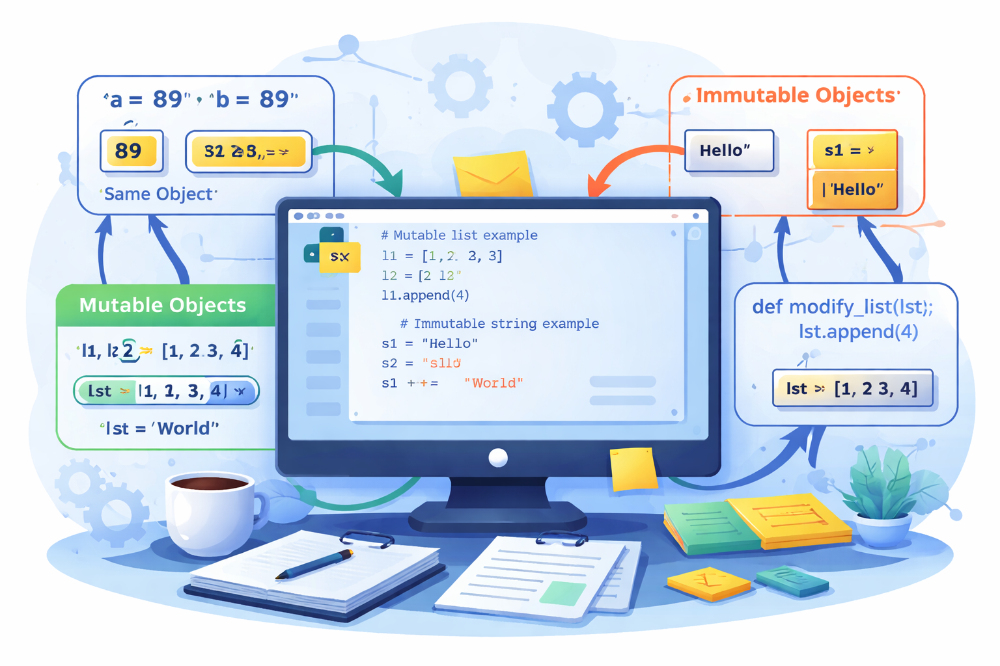

# Python3: Mutable, Immutable... everything is object!




## Introduction
This project forced me to stop thinking of Python variables as little storage boxes. In Python, a variable is just a label that currently points to an object. That single idea explains a huge amount of Python behavior: why two names can refer to the same list, why updating a list can affect another variable, and why function calls sometimes seem to "change" values outside the function. Integers, strings, lists, tuples, functions, and classes all follow the same object model, so once that model is clear, Python becomes much more predictable.

This first example shows rebinding with an integer.

```python
a = 1
b = a
a = 2

print(a)
print(b)
```

```text
2
1
```

This second example shows two names pointing to the same list.

```python
l1 = [1, 2, 3]
l2 = l1
l1.append(4)

print(l1)
print(l2)
```

```text
[1, 2, 3, 4]
[1, 2, 3, 4]
```

## id and type
Each Python object comes with two basic properties that are useful for reasoning about code: its identity and its type. `id()` tells us which specific object we are dealing with at that moment, while `type()` tells us the class of that object. Those two pieces of information are not the same thing. Two values can be equal even when they are stored in different objects, and two variables can have the same `id()` because they are just two names attached to one object. That is why `==` and `is` answer different questions. The exact integer returned by `id()` changes from one execution to another, but it still identifies the current object.

Here, `type()` identifies the object class and `id()` identifies the object itself.

```python
x = 89
print(type(x))
print(id(x))
```

```text
<class 'int'>
140391625534000
```

This example shows two variables sharing one string object.

```python
s1 = "Holberton"
s2 = s1

print(id(s1) == id(s2))
print(s1 is s2)
print(s1 == s2)
```

```text
True
True
True
```

This one shows equal lists that are still different objects.

```python
l1 = [1, 2, 3]
l2 = [1, 2, 3]

print(l1 == l2)
print(l1 is l2)
```

```text
True
False
```

## Mutable Objects
Mutable objects are objects whose contents can be updated without creating a replacement object. Lists, dictionaries, and sets are the most common examples. When a mutable object is changed in place, Python usually keeps the same identity and simply updates the existing object. That detail is exactly why aliases are so important: if several names refer to the same mutable object, a change made through one name is visible through all of them. Most accidental side effects with lists happen because of this shared reference behavior.

In this case, mutating `l1` also changes what `l2` sees.

```python
l1 = [1, 2, 3]
l2 = l1
l1.append(4)

print(l2)
```

```text
[1, 2, 3, 4]
```

This example shows that `+=` changes the same list in place.

```python
a = [1, 2, 3]
b = a
a += [4]

print(a)
print(b)
print(a is b)
```

```text
[1, 2, 3, 4]
[1, 2, 3, 4]
True
```

## Immutable Objects
Immutable objects work differently because their value cannot be altered in place after the object has been created. Numbers, strings, booleans, and tuples fit in this category. When code seems to "change" one of these objects, what actually happens is that Python builds another object and reattaches the variable name to that new object. That is why a second variable that used to share the original object often stays untouched. The advanced yes/no tasks in this directory reinforced that tuples behave differently from lists because the tuple itself cannot be modified in place.

This example shows that changing an integer creates a different object.

```python
n = 3
old_id = id(n)
n += 1

print(n)
print(old_id == id(n))
```

```text
4
False
```

Here, `a` is rebound, while `b` still points to the original integer.

```python
a = 1
b = a
a = a + 1

print(a)
print(b)
```

```text
2
1
```

## Why It Matters and How Python Treats Mutable and Immutable Objects Differently
This distinction matters in real code because it affects assignment, copying, comparisons, debugging, and unexpected side effects. With immutable objects, reassigning a variable does not rewrite the original object, so other references keep pointing to the old value. With mutable objects, an in-place update changes the shared object itself, so every alias sees the new state. Python is consistent here, but the result can be confusing if you only look at the syntax. Two lines of code can look almost the same while one mutates an object and the other creates a brand-new one.

This comparison separates value equality from object identity.

```python
a = [1, 2, 3]
b = [1, 2, 3]

print(a == b)
print(a is b)
```

```text
True
False
```

This example creates a new list instead of modifying the old shared one.

```python
a = [1, 2, 3]
b = a
a = a + [4]

print(a)
print(b)
print(a is b)
```

```text
[1, 2, 3, 4]
[1, 2, 3]
False
```

This last check shows what happens when both names still point to one object.

```python
a = [1, 2, 3]
b = a

print(a == b)
print(a is b)
```

```text
True
True
```

## How Arguments Are Passed to Functions and What That Implies for Mutable and Immutable Objects
Function calls follow the same object rules as assignment. When an argument is passed to a function, Python gives the function a local name that refers to the same object the caller passed in. Because of that, mutating a mutable argument inside the function changes the original object seen by the caller. Rebinding the parameter name does not. This section also connects directly to `19-copy_list.py`, where slicing is used to return a new list object instead of another reference to the same one.

Here the function only rebinds its local integer parameter.

```python
def increment(n):
    n += 1

a = 1
increment(a)
print(a)
```

```text
1
```

This function mutates the list, so the caller sees the change.

```python
def increment_list(lst):
    lst += [4]

numbers = [1, 2, 3]
increment_list(numbers)
print(numbers)
```

```text
[1, 2, 3, 4]
```

This example shows that assigning one parameter to another stays local to the function.

```python
def assign_value(left, right):
    left = right

l1 = [1, 2, 3]
l2 = [4, 5, 6]
assign_value(l1, l2)
print(l1)
```

```text
[1, 2, 3]
```

This final example uses `copy_list` to return a separate list object.

```python
def copy_list(a_list):
    return a_list[:]

original = [1, 2, 3]
clone = copy_list(original)

print(original)
print(clone)
print(original == clone)
print(original is clone)
```

```text
[1, 2, 3]
[1, 2, 3]
True
False
```

## Conclusion
My main takeaway from this project is that Python stays consistent once you view everything through objects and references. The examples from this directory make that very clear: some comparisons return `True` because values match, others return `False` because the objects are different, list updates can affect every alias, and reassignment inside a function may leave the original object untouched. Once I started reading Python that way, mutable and immutable behavior stopped feeling random and started feeling logical.

## URLs
- LinkedIn share URL: https://www.linkedin.com/feed/update/urn:li:share:7446726510876622848/